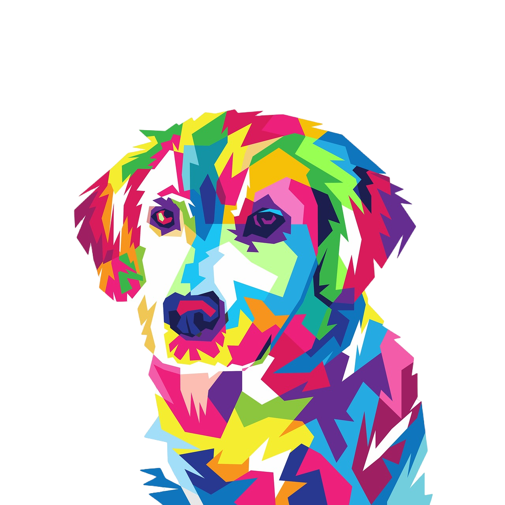

# PET HUB - Group 6
# Project 2: Interactive Full-Stack Application 

This full-stack application is created for pet shelter like business. We take in animals, groom and update the needed medical level for each animal. We want to display care for all animals that we are able to take end and afford.

This application technology stack includes: JS, MySQL, NODEJS, OOP, Express, Handlebars, bcrypt, ORM, MVC, Sequelize and bootstrap.

# Heroku Link
[PET HUB URL - HEROKU LINK](https://pet-shelter-g6.herokuapp.com/)

## Coders:

## User Story:
* Use Node.js and Express.js to create a RESTful API.

* Use Handlebars.js as the template engine.

* Use MySQL and the Sequelize ORM for the database.

* Have both GET and POST routes for retrieving and adding new data.

* Use at least one new library, package, or technology that we haven’t discussed.

* Have a folder structure that meets the MVC paradigm.

* Include authentication (express-session and cookies).

* Protect API keys and sensitive information with environment variables.

* Be deployed using Heroku (with data).

* Have a polished UI.

* Be responsive.

* Be interactive (i.e., accept and respond to user input).

* Meet good-quality coding standards (file structure, naming conventions, follows best practices for class/id naming conventions, indentation, quality comments, etc.) .
